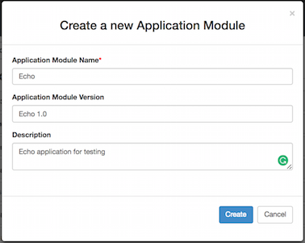
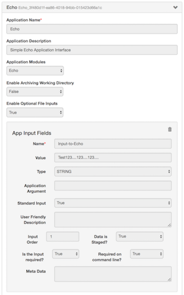
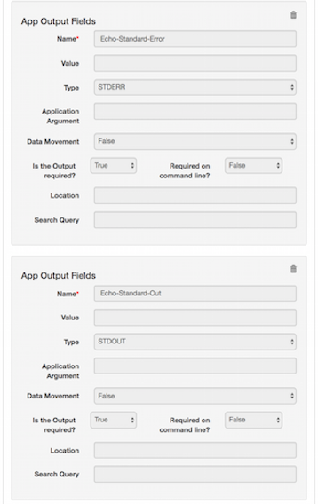
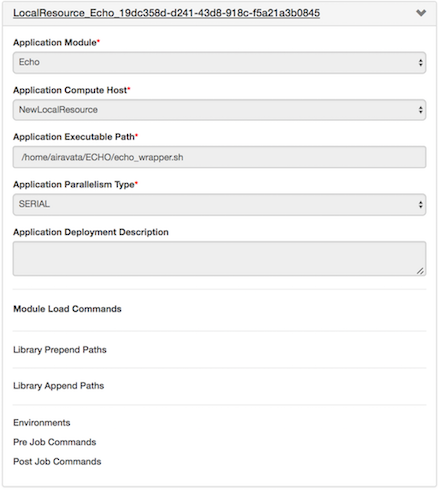
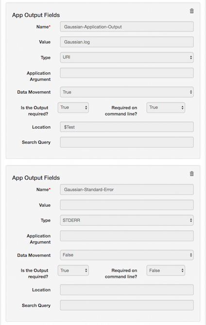
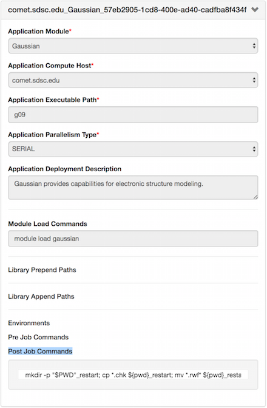

## Admin Dashboard Configurations

This page is dedicated to Gateway Admins!

### Prior to starting your configurations
1. You have admin access to the PGA portal, Admin Dashboard
    - How to check?
        - Log in to the gateway portal
        - You would land on Admin Dashboard with "Let's Get Started!"
        - Click 'Browse Application Modules'
        - Do you see button 'Create new Application Interface' ? Then you are good.
2. Storage resource ID added to the pga_config.php  
    - If not go to  
        - Admin Dashboard --> Storage Resources --> Browse
        - Locate your resource and copy the ID
        - Paste it in pga_config.php file in pga/app/config directory.
3. Credentials generated, assigned and added to authorized_keys files of resources
    - To generate key refer <a href=/Gateway-Configurations/#Credentials> Credential Store</a>
    - Token Assignment <a href=/Gateway-Configurations/#Preference> Gateway Management</a>
    - Copy the public key for the assigned token frm credential store and add it to authorized_keys file in both compute and storage resources.

NOTE: If you are using a hosted gateway the 2 and 4 would be taken cared by the SciGaP team.

### Select Your Quick Start Tutorial
1. <a href="#LocalJob">Running Echo on Local Machine</a> 
2. <a href="#GaussianJob">Gaussian Job Submission to Comet (XSEDE resource)</a> 
3. <a href="#PrePostCommands">Add Pre and Post Job Commands for an Application</a> 
4. <a href="#SampleApp">Add Environment Variables for an Application Deployment</a> 
5. <a href= "#Resources">Know your Compute & Storage Resources</a> 
6. <a href= "#Preference">Gateway Preference Management</a> 
7. <a href= "#GtwyAccess">Managing User Accounts</a> 
8. <a href= "#Notices">Communication with Gateway Users</a> 
9. <a href= "#Traffic">Monitor Gateway Traffic</a> 
10. <a href= "#Secure">Using Credential Store</a> 

#####<h5 id="LocalJob">Running Echo on Local Machine</h5>
Quickest way to confirm Airavata and PGA setup. This will tell you what you need to do to Echo a simple 'Hello World' in your local machine

1. Create new application module: Echo
    - Navigate to Admin Dashboard &rarr; App Catalog &rarr; Apllication Module 
    - Click Create a new Application Module
    - Enter Application Module Name: Echo
    - Enter Application Module Version: Echo 1.0 (Not mandatory)
    - Enter Description: Echo application for testing
    - Create
    - This create the Echo module  
   
2. Create the application interface: Echo
    - Navigate to Admin Dashboard &rarr; App Catalog &rarr; Application Interface
    - Click 'Create new Application Interface'
    - Add Application Name: Echo
    - Add Application Description: Echo Interface for testing
    - Select Application Module: Echo
    - Set 'Enable Archiving Working Directory' to False (Why? - This is set to true if you want to bring back all the files in working directory back to PGA)
    - Set 'Enable Optional File Inputs' to False (Why? - Set to false because there won't be any additional optional inputs for Echo)
    - Provide application inputs
        - Click Add Application Input
        - Name: Input-to-Echo
        - Value: Echo Test 1......2......3....... (This value can be overridden at experiment creation)
        - Type: STRING
        - Application Arguments:
        - Standard Input: False (Why? - Futuristic property and not in real use at the moment)
        - User Friendly Description: Enter STRING input for Echo (Not mandatory)
        - Input Order: 1
        - Data is Staged: True
        - Is the Input Required: True
        - Required in Commandline: True
        - Meta Data:
    - Provide application outputs
    NOTE: 3 application outputs to define. 
        - 1st output
            - Click Add Application Output
            - Name: Echo-Standard-Out
            - Value:
            - Type: STDOUT
            - Application Argument:
            - Data Movement: False
            - Is the Output required?: True
            - Required on command line?: True
            - Location:
            - Search Query: 
        - 2nd output
            - Click Add Application Output
            - Name: Echo-Standard-Error
            - Value:
            - Type: STDERR
            - Application Argument:
            - Data Movement: False
            - Is the Output required?: True
            - Required on command line?: True
            - Location:
            - Search Query: 
    
3. Create the application deployment: Echo on Local Machine
    - Navigate to Admin Dashboard &rarr; App Catalog &rarr; Application Deployment
    - Click 'Create new Application Deployment'
        - Application Module: Echo
        - Application Compute Host: Local (Local machine has to be added as a compute resource prior to this step)
        - Application Executable Path: /home/airavata/ECHO/echo_wrapper.sh (Local to where you have airavata installed)
        - Application Parallelism Type: SERIAL  

4. Echo_wrapper.sh contains;
<pre><code>
    #!/bin/bash
    #sleep 10
    echo "Echoed_Output=$*" 
</code></pre>
           
#####<h5 id="GaussianJob">Gaussian Job Submission to Comet  (XSEDE resource)</h5>
This is a tutorial to configuring and running an application on XSEDE resource through PGA portal.

1. Create new application module: Gaussian
    - Navigate to Admin Dashboard &rarr; App Catalog &rarr; Apllication Module 
    - Click Create a new Application Module
    - Enter Application Module Name: Gaussian
    - Enter Application Module Version: Gaussian 09 (Not mandatory)
    - Enter Description: Gaussian provides capabilities for electronic structure modeling
    - Create
    - This create the Gaussian module  
2. Create the application interface: Gaussian
    - Navigate to Admin Dashboard &rarr; App Catalog &rarr; Application Interface
    - Click 'Create new Application Interface'
    - Add Application Name: Gaussian
    - Add Application Description: Gaussian provides capabilities for electronic structure modeling
    - Select Application Module: Gaussian ( If multiple modules are using same interface here you can add multiple modules. Ex: Gaussian 03 and Gaussian 09 modules)
    - Set 'Enable Archiving Working Directory' to True (Why? - This is set to true when you want to bring back all the files in working directory back to PGA. Caution: If there are very large files they may not be able to SCP)
    - Set 'Enable Optional File Inputs' to False (Why? - Set to false because there won't be any additional optional inputs for Gaussian)
    - Provide application inputs
        - Click Add Application Input
        - Name: Input-File
        - Value: 
        - Type: URI (Why - This is the type for file uploads)
        - Application Arguments:
        - Standard Input: False (Why? - Futuristic property and not in real use at the moment)
        - User Friendly Description: Gaussian input file specifying desired calculation type, model chemistry, molecular system and other parameters. (This is information to the user at creating job experiment. Not mandatory)
        - Input Order: 1
        - Data is Staged: False
        - Is the Input Required: True
        - Required in Commandline: True
        - Meta Data:
    - Provide application outputs 
    NOTE: 3 application outputs to define.  
        - 1st Output
            - Click Add Application Output
            - Name: Gaussian-Application-Output
            - Value: Gaussian.log
            - Type: URI
            - Application Argument:
            - Data Movement: True
            - Is the Output required?: True
            - Required on command line?: True
            - Location:
            - Search Query: 
        - 2nd output
            - Click Add Application Output
            - Name: Gaussian-Standard-Out
            - Value:
            - Type: STDOUT
            - Application Argument:
            - Data Movement: False
            - Is the Output required?: True
            - Required on command line?: True
            - Location:
            - Search Query: 
        - 3rd output
            - Click Add Application Output
            - Name: Gaussian-Standard-Error
            - Value:
            - Type: STDERR
            - Application Argument:
            - Data Movement: False
            - Is the Output required?: True
            - Required on command line?: True
            - Location:
            - Search Query: 
     
3. Create the application deployment: Gaussian on Comet
    - Navigate to Admin Dashboard &rarr; App Catalog &rarr; Application Deployment
    - Click 'Create new Application Deployment'
        - Application Module: Gaussian
        - Application Compute Host: comet.sdsc.edu (Your comet specific gateway preferences need to be added in 'Gateway Management' prior to this)
        - Application Executable Path: g09
        - Application Parallelism Type: SERIAL
        - Application Deployment Description: Gaussian provides capabilities for electronic structure modeling.
        - Module Load Commands: module load gaussian
        - Post Job Commands: mkdir -p "$PWD"_restart; cp *.chk ${pwd}_restart; mv *.rwf* ${pwd}_restart; (Why? - any command you would want to execute after post job execution) 

##### <h5 id="PrePostCommands">Add Pre and Post Job Commands for an Application</h5>
This tutorial demonstrates use of pre and post job commands and how they appear in job submission script

1. 

Work-in-Progress

Refer <a href="/Gateway-Configurations/#AppCatalog" target="_blank">Application Configuration</a> for more generic details.

