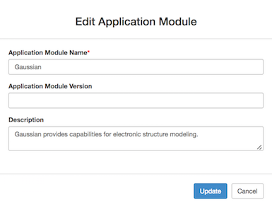

## Admin Dashboard Configurations

This page is dedicated to Gateway Admins!

### Prior to starting your configurations
1. You have admin access to the PGA portal, Admin Dashboard
    - How to check?
        - Log in to the gateway portal
        - You would land on Admin Dashboard with "Let's Get Started!"
        - Click 'Browse Application Modules'
        - Do you see button 'Create new Application Interface' ? Then you are good.
2. Storage resource ID is added to the pga_config.php  
    - If not go to  
        - Admin Dashboard &rarr; Storage Resources &rarr; Browse
        - Locate your resource and copy the ID
        - Paste it in pga_config.php file in pga/app/config directory.
3. Credentials generated, assigned and added to authorized_keys files of resources
    - To generate key refer <a href=/Gateway-Configurations/#Credentials> Credential Store</a>
    - Token Assignment <a href=/Gateway-Configurations/#Preference> Gateway Management</a>
    - Copy the public key for the assigned token frm credential store and add it to authorized_keys file in both compute and storage resources.

NOTE: If you are using a hosted gateway the 2 and 4 would be taken cared by the SciGaP team.

### Select Your Quick Start Tutorial
1. <a href="#LocalJob">Running Echo on Local Machine</a> 
2. <a href="#GaussianJob">Gaussian Job Submission to Comet (XSEDE resource)</a> 
3. <a href="#PrePostCommands">Add Pre and Post Job Commands for an Application</a> 
4. <a href="#SampleApp">Add Environment Variables for an Application Deployment</a> 
5. <a href= "#Resources">Register your Compute & Storage Resources</a> 
6. <a href= "#Preference">Gateway Preference Management</a> 
7. <a href= "#GtwyAccess">Managing User Accounts</a> 
8. <a href= "#Notices">Communication with Gateway Users</a> 
9. <a href= "#Traffic">Monitor Gateway Traffic</a> 
10. <a href= "#Secure">Using Credential Store</a> 

#####<h5 id="LocalJob">Running Echo on Local Machine</h5>
Quickest way to confirm Airavata and PGA setup. This will tell you what you need to do to Echo a simple 'Hello World' in your local machine.

1. Create new application module: Echo
    - Navigate to Admin Dashboard &rarr; App Catalog &rarr; Application Module 
    - Click Create a new Application Module
    - Enter Application Module Name: Echo
    - Enter Application Module Version: Echo 1.0 (Not mandatory)
    - Enter Description: Echo application for testing
    - Create
    - This create the Echo module  
   
2. Create the application interface: Echo
    - Navigate to Admin Dashboard &rarr; App Catalog &rarr; Application Interface
    - Click 'Create new Application Interface'
    - Add Application Name: Echo
    - Add Application Description: Echo Interface for testing
    - Select Application Module: Echo
    - Set 'Enable Archiving Working Directory' to False (Why? - This is set to true if you want to bring back all the files in working directory back to PGA)
    - Set 'Enable Optional File Inputs' to False (Why? - Set to false because there won't be any additional optional inputs for Echo)
    - Provide application inputs
        - Click Add Application Input
        - Name: Input-to-Echo
        - Value: Echo Test 1......2......3....... (This value can be overridden at experiment creation)
        - Type: STRING
        - Application Arguments:
        - Standard Input: False (Why? - Futuristic property and not in real use at the moment)
        - Is Read Only: False (Why? - When this is set to true the input value will only be 'read-only'. User cannot change at experiment creation,edit or clone).
        - User Friendly Description: Enter STRING input for Echo (Not mandatory)
        - Input Order: 1
        - Data is Staged: True
        - Is the Input Required: True
        - Required in Commandline: True
        - Meta Data:
    - Provide application outputs
    NOTE: 3 application outputs to define. 
        - 1st output
            - Click Add Application Output
            - Name: Echo-Standard-Out
            - Value:
            - Type: STDOUT
            - Application Argument:
            - Data Movement: False
            - Is the Output required?: True
            - Required on command line?: True
            - Location:
            - Search Query: 
        - 2nd output
            - Click Add Application Output
            - Name: Echo-Standard-Error
            - Value:
            - Type: STDERR
            - Application Argument:
            - Data Movement: False
            - Is the Output required?: True
            - Required on command line?: True
            - Location:
            - Search Query: 
    
3. Create the application deployment: Echo on Local Machine
    - Navigate to Admin Dashboard &rarr; App Catalog &rarr; Application Deployment
    - Click 'Create new Application Deployment'
        - Application Module: Echo
        - Application Compute Host: Local (Local machine has to be added as a compute resource prior to this step)
        - Application Executable Path: /home/airavata/ECHO/echo_wrapper.sh (Local to where you have airavata installed)
        - Application Parallelism Type: SERIAL  

4. echo_wrapper.sh contains;
<pre><code>
    #!/bin/bash
    #sleep 10
    echo "Echoed_Output=$*" 
</code></pre>
           
#####<h5 id="GaussianJob">Gaussian Job Submission to Comet  (XSEDE resource)</h5>
This is a tutorial to configuring and running an application on XSEDE resource through PGA portal.

1. Create new application module: Gaussian
    - Navigate to Admin Dashboard &rarr; App Catalog &rarr; Application Module 
    - Click Create a new Application Module
    - Enter Application Module Name: Gaussian
    - Enter Application Module Version: Gaussian 09 (Not mandatory)
    - Enter Description: Gaussian provides capabilities for electronic structure modeling
    - Create
    - This create the Gaussian module  

2. Create the application interface: Gaussian
    - Navigate to Admin Dashboard &rarr; App Catalog &rarr; Application Interface
    - Click 'Create new Application Interface'
    - Add Application Name: Gaussian
    - Add Application Description: Gaussian provides capabilities for electronic structure modeling
    - Select Application Module: Gaussian ( If multiple modules are using same interface here you can add multiple modules. Ex: Gaussian 03 and Gaussian 09 modules)
    - Set 'Enable Archiving Working Directory' to True (Why? - This is set to true when you want to bring back all the files in working directory back to PGA. Caution: If there are very large files they may not be able to SCP)
    - Set 'Enable Optional File Inputs' to False (Why? - Set to false because there won't be any additional optional inputs for Gaussian)
    - Provide application inputs
        - Click Add Application Input
        - Name: Input-File
        - Value: 
        - Type: URI (Why? - This is the type for file uploads)
        - Application Arguments:
        - Standard Input: False (Why? - Futuristic property and not in real use at the moment)
        - User Friendly Description: Gaussian input file specifying desired calculation type, model chemistry, molecular system and other parameters. (This is information to the user at creating job experiment. Not mandatory)
        - Input Order: 1
        - Data is Staged: False
        - Is the Input Required: True
        - Required in Commandline: True
        - Meta Data:
    - Provide application outputs 
    NOTE: 3 application outputs to define.  
        - 1st Output
            - Click Add Application Output
            - Name: Gaussian-Application-Output
            - Value: Gaussian.log
            - Type: URI
            - Application Argument:
            - Data Movement: True
            - Is the Output required?: True
            - Required on command line?: True
            - Location:
            - Search Query: 
        - 2nd output
            - Click Add Application Output
            - Name: Gaussian-Standard-Out
            - Value:
            - Type: STDOUT
            - Application Argument:
            - Data Movement: False
            - Is the Output required?: True
            - Required on command line?: True
            - Location:
            - Search Query: 
        - 3rd output
            - Click Add Application Output
            - Name: Gaussian-Standard-Error
            - Value:
            - Type: STDERR
            - Application Argument:
            - Data Movement: False
            - Is the Output required?: True
            - Required on command line?: True
            - Location:
            - Search Query: 
     
3. Create the application deployment: Gaussian on Comet
    - Navigate to Admin Dashboard &rarr; App Catalog &rarr; Application Deployment
    - Click 'Create new Application Deployment'
        - Application Module: Gaussian
        - Application Compute Host: comet.sdsc.edu (Your comet specific gateway preferences need to be added in 'Gateway Management' prior to this)
        - Application Executable Path: g09
        - Application Parallelism Type: SERIAL
        - Application Deployment Description: Gaussian provides capabilities for electronic structure modeling.
        - Module Load Commands: module load gaussian
        - Post Job Commands: mkdir -p "$PWD"_restart; cp *.chk ${pwd}_restart; mv *.rwf* ${pwd}_restart; (Why? - any command you would want to execute after post job execution) 

##### <h5 id="PrePostCommands">Add Pre and Post Job Commands for an Application</h5>
- This tutorial demonstrates use of pre and post job commands and how they appear in job submission script.  
- For application executions we would require to use pre and post job commands. 
- In this tutorial we are using an application which has both pre and post job commands in use. Existence of pre and post job commands could be application specific or specific to the application residing compute resource.

###### <b><u>NEK5000 </u></b>
1. Create new application module: NEK5000
    - Navigate to Admin Dashboard &rarr; App Catalog &rarr; Application Module 
    - Click Create a new Application Module
    - Enter Application Module Name: NEK5000
    - Enter Application Module Version: (Not mandatory)
    - Enter Description: Open source, highly scalable and portable spectral element code designed to simulate
    - Create
    - This create the NEK5000 module  

2. Create the application interface: NEK5000
    - Navigate to Admin Dashboard &rarr; App Catalog &rarr; Application Interface
    - Click 'Create new Application Interface'
    - Add Application Name: NEK5000
    - Add Application Description: Open source, highly scalable and portable spectral element code designed to simulate
    - Select Application Module: NEK5000 ( If multiple modules are using same interface here you can add multiple modules. Ex: Gaussian 03 and Gaussian 09 modules)
    - Set 'Enable Archiving Working Directory' to True (Why? - This is set to true when you want to bring back all the files in working directory back to PGA. Caution: If there are very large files they may not be able to SCP)
    - Set 'Enable Optional File Inputs' to False (Why? - Set to false because there won't be any additional optional inputs for NEK5000)
    - Provide application inputs
        - Click Add Application Input
        - 1st Input
            - Name: Basename
            - Value: nek5kbasename
            - Type: STRING (Why? - Input is a string value)
            - Application Arguments:
            - Standard Input: False (Why? - Futuristic property and not in real use at the moment)
            - Is Read Only: True (Why? - This value should not be changed by the gateway user at experiment creation)
            - User Friendly Description:
            - Input Order: 0
            - Data is Staged: False
            - Is the Input Required: True
            - Required in Commandline: True
            - Meta Data:
        - 2nd Input
            - Name: User-Subroutine-File
            - Value: nek5kbasename.usr (Why? - Name of the file upload will be changed to the name given as the value here. Application level requirement)
            - Type: URI
            - Application Arguments:
            - Standard Input: False (Why? - Futuristic property and not in real use at the moment)
            - Is Read Only: False (Why? - This is a URI type input.)
            - User Friendly Description: .usr File (Why? - This provides user with information related to the input file.)
            - Input Order: 1
            - Data is Staged: False
            - Is the Input Required: True
            - Required in Commandline: False
            - Meta Data:
        - 3rd Input
            - Name: Runtime-Parameter-File
            - Value: nek5kbasename.rea (Why? - Name of the file upload will be changed to the name given as the value here. Application level requirement)
            - Type: URI
            - Application Arguments:
            - Standard Input: False (Why? - Futuristic property and not in real use at the moment)
            - Is Read Only: False (Why? - This is a URI type input.)
            - User Friendly Description: .rea File (Why? - This provides user with information related to the input file.)
            - Input Order: 2
            - Data is Staged: False
            - Is the Input Required: True
            - Required in Commandline: False
            - Meta Data:
        - 4th Input
            - Name: Size-for-Memory-Allocation
            - Value:
            - Type: URI
            - Application Arguments:
            - Standard Input: False (Why? - Futuristic property and not in real use at the moment)
            - Is Read Only: False (Why? - This is a URI type input.)
            - User Friendly Description: SIZE File (Why? - This provides user with information related to the input file.)
            - Input Order: 3
            - Data is Staged: False
            - Is the Input Required: True
            - Required in Commandline: False
            - Meta Data:
    - Provide application outputs 
    NOTE: 3 application outputs to define.  
        - 1st Output
            - Click Add Application Output
            - Name: NEK5000-Compilation-Output
            - Value: compiler.out
            - Type: URI
            - Application Argument:
            - Data Movement: False
            - Is the Output required?: True
            - Required on command line?: True
            - Location:
            - Search Query: 
        - 2nd Output
            - Click Add Application Output
            - Name: NEK5000-Output_tarball
            - Value: nek5kbasename.tgz
            - Type: URI
            - Application Argument:
            - Data Movement: False
            - Is the Output required?: True
            - Required on command line?: False
            - Location:
            - Search Query: 
        - 3rd Output
            - Click Add Application Output
            - Name: NEK5000-Session-Out
            - Value: session.log
            - Type: URI
            - Application Argument:
            - Data Movement: False
            - Is the Output required?: True
            - Required on command line?: True
            - Location:
            - Search Query:             
        - 4th output
            - Click Add Application Output
            - Name: NEK5000-Standard-Out
            - Value:
            - Type: STDOUT
            - Application Argument:
            - Data Movement: False
            - Is the Output required?: True
            - Required on command line?: False
            - Location:
            - Search Query: 
        - 5th output
            - Click Add Application Output
            - Name: NEK5000-Standard-Error
            - Value:
            - Type: STDERR
            - Application Argument:
            - Data Movement: False
            - Is the Output required?: True
            - Required on command line?: False
            - Location:
            - Search Query: 
         
3. Create the application deployment: NEK5000 on BigRed2 (BigRed2 is the IU cluster. Using just as an example)
    - Navigate to Admin Dashboard &rarr; App Catalog &rarr; Application Deployment
    - Click 'Create new Application Deployment'
        - Application Module: Gaussian
        - Application Compute Host: bigred2.uits.iu.edu (Your cluster specific gateway preferences need to be added in 'Gateway Management' prior to this)
        - Application Executable Path: ./nek5000
        - Application Parallelism Type: CRAY_MPI
        - Application Deployment Description: Gaussian provides capabilities for electronic structure modeling.
        - Module Load Commands: module swap PrgEnv-cray PrgEnv-gnu; module load nek5000 visit ffmpeg
        - Pre Job Commands: 
            - echo "nek5kbasename" > genmap.in;  echo "0.2" >> genmap.in;
            - echo nek5kbasename  > ./SESSION.NAME; echo 'pwd'/' >>  ./SESSION.NAME;
        - Post Job Commands: 
            - mkdir -p "$PWD"_restart; cp *.chk ${pwd}_restart; mv *.rwf* ${pwd}_restart; (Why? - any command you would want to execute after post job execution) 

4. NEK5000 job script.  Please view the existence and placement of both pre and post job commands in the job script.

Refer <a href="/Gateway-Configurations/#AppCatalog" target="_blank">Application Configuration</a> for more generic details.

##### <h5 id="SampleApp">Add Environment Variables for an Application Deployment</h5>
1. 

##### <h5 id="Resources">Register your Compute & Storage Resources</h5> 
###### <b><u>Register Local Resource </u></b>
NOTE: Gateway admins can only add compute resources and storage resources if they have super admin access to the gateway portal. If the portal is hosted locally they would have super admin access.

1. Navigate to Admin Dashboard &rarr; Compute Resource &rarr; Register  
2. Provide
    - Host Name: Local Resource 
    - Host Aliases:  
    - IP Addresses: 
    - Resource Description: My local resource for application execution ( Just a description) 
    - Create 
3. In Queues tab 
    - Click 'Add a Queue' 
    - Queue Name: Normal ( Per resource this is a unique value. Once created cannot edit the name. If need to change, delete and create again) 
    - Queue Description: Local resource normal for job submission 
    - Queue Max Run Time (In Minutes): (Note required for the local resource) 
    - Queue Max Nodes: (Note required for the local resource) 
    - Queue Max Processors: (Note required for the local resource) 
    - Max Jobs in Queue: (Note required for the local resource) 
    - Max Memory For Queue( In MB ): (Note required for the local resource) 
4. File System 
    - Nothing to add here, this is futuristic development. 
5. Job Submission Interface 
    - Click on the tab 
    - Add a new Job Submission Interface 
    - Job Submission Protocol: Local 
    - Select resource manager type: FORK 
    - Job Commands (SUBMISSION): /bin/sh 
    - Add Job Submission Protocol 
6.  Data Movement Interface 
    - Add a new Data Submission Interface 
    - Data Movement Protocol: Local 
    - Add Job Submission Protocol 
Now the Local resource is ready for job submissions. 

###### <b><u>Register a XSEDE Resource </u></b>
1. Navigate to Admin Dashboard &rarr; Compute Resource &rarr; Register  
2. Provide
    - Host Name: comet.sdsc.edu 
    - Host Aliases:  
    - IP Addresses: 
    - Resource Description: SDSC Comet Cluster ( Just a description) 
    - Create 
3. In Queues tab 
    - Click 'Add a Queue' 
    - Queue 1
        - Queue Name: compute ( Per resource this is a unique value. Once created cannot edit the name. If need to change, delete and create again) 
        - Queue Description: Used for access to regular compute nodes 
        - Queue Max Run Time (In Minutes): 280 (Note required for the local resource) 
        - Queue Max Nodes: 72 (Note required for the local resource) 
        - Queue Max Processors: 1728 (Note required for the local resource) 
        - Max Jobs in Queue: 0 (Note required for the local resource) 
        - Max Memory For Queue( In MB ): (Note required for the local resource) 
    - Queue 2
        - Queue Name: shared ( Per resource this is a unique value. Once created cannot edit the name. If need to change, delete and create again) 
        - Queue Description: Single-node jobs using fewer than 24 cores 
        - Queue Max Run Time (In Minutes): 2880 (Note required for the local resource) 
        - Queue Max Nodes: 1 (Note required for the local resource) 
        - Queue Max Processors: 24 (Note required for the local resource) 
        - Max Jobs in Queue: 0 (Note required for the local resource) 
        - Max Memory For Queue( In MB ): (Note required for the local resource) 
4. File System 
    - Nothing to add here, this is futuristic development. 
5. Job Submission Interface 
    - Click on the tab 
    - Add a new Job Submission Interface 
    - Job Submission Protocol: SSH 
    - Select Security Protocol: SSH_KEYS
    - SSH Port: 22
    - Select resource manager type: SLURM 
    - Job Manager Bin Path: /usr/bin/
    - Job Commands (SUBMISSION): sbatch 
    - Job Commands (JOB_MONITORING): squeue 
    - Job Commands (DELETION): scancel 
    - Parallelism Prefixes (MPI): mpiexec  
    - Add Job Submission Protocol 
6.  Data Movement Interface 
    - Add a new Data Submission Interface 
    - Data Movement Protocol: SCP 
    - Select Security Protocol: SSH_KEYS  
    - SSH Port: 22  
    - Add Data Movement Protocol 
Now the Local resource is ready for job submissions. 
Comet is ready for job submissions.     

###### <b><u>Register a Campus Resource </u></b>
NOTE: Adding a campus resource is similar to adding a XSEDE resource. Same steps to follow with similar information.

##### <h5 id="Resources">Gateway Preference Management</h5>
1. 
##### <h5 id="Resources">Managing User Accounts</h5>
1. 
##### <h5 id="Resources">Communication with Gateway Users</h5>
1. 
##### <h5 id="Resources">Monitor Gateway Traffic</h5>
1. 
##### <h5 id="Resources">Using Credential Store</h5>
1. 

Work-in-Progress

