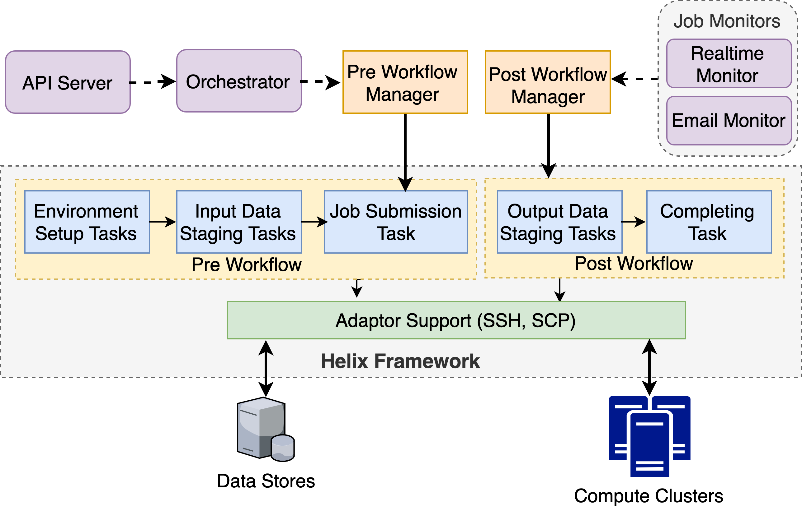
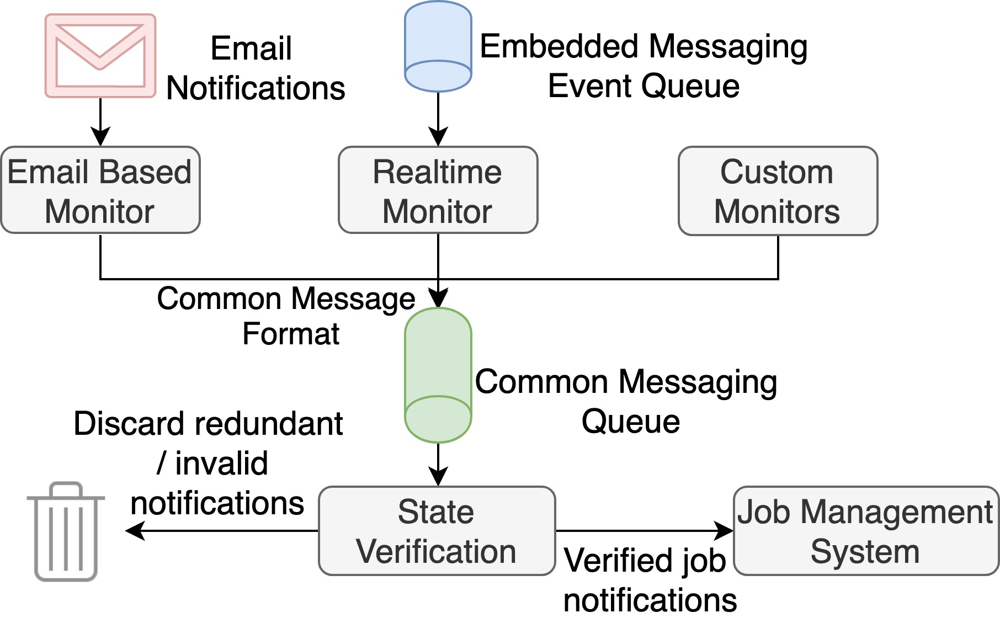

## Job Management

Job Management is a key component of Airavata and we recently upgraded the GFac based Job Management system to a new
system which is more efficient and extendible. Job Management system mainly covers two areas
  
1. Executing workflows related to job submission and data transfers among compute and storage resources
2. Monitoring the status of already executing jobs in the remote compute resources

For executing workflows, we use Apache Helix as a generic workflow engine. Workflow managers accept workflow execution 
requests from the orchestrator and job monitors and transfers those requests into the Helix cluster to execute them. Helix
cluster is aware of how to decode those requests and execute workflows reliably and efficiently. Tasks in the Helix cluster
uses Adaptor Support libraries to talk to external resources according the relevant protocol and security guidelines.

For job monitoring, new system supports multiple job monitoring mechanisms. Email monitoring is the primary method of 
monitoring jobs where it listens to the email alters sent by compute resources while the jobs' states were changed. 
Realtime monitoring is the new mechanism we added into the monitoring framework where it gets notified directly from the 
jobs when their states are changed. Using both of these mechanisms, we managed to achieve both reduced response time and
better accuracy in job monitoring.

