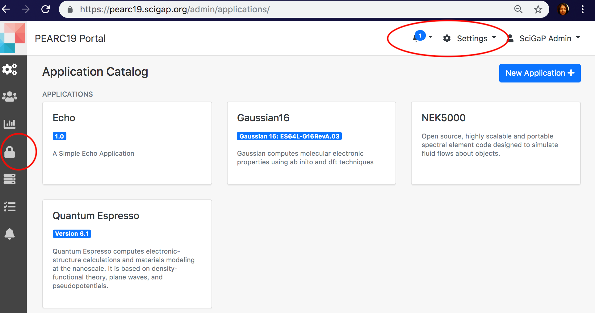
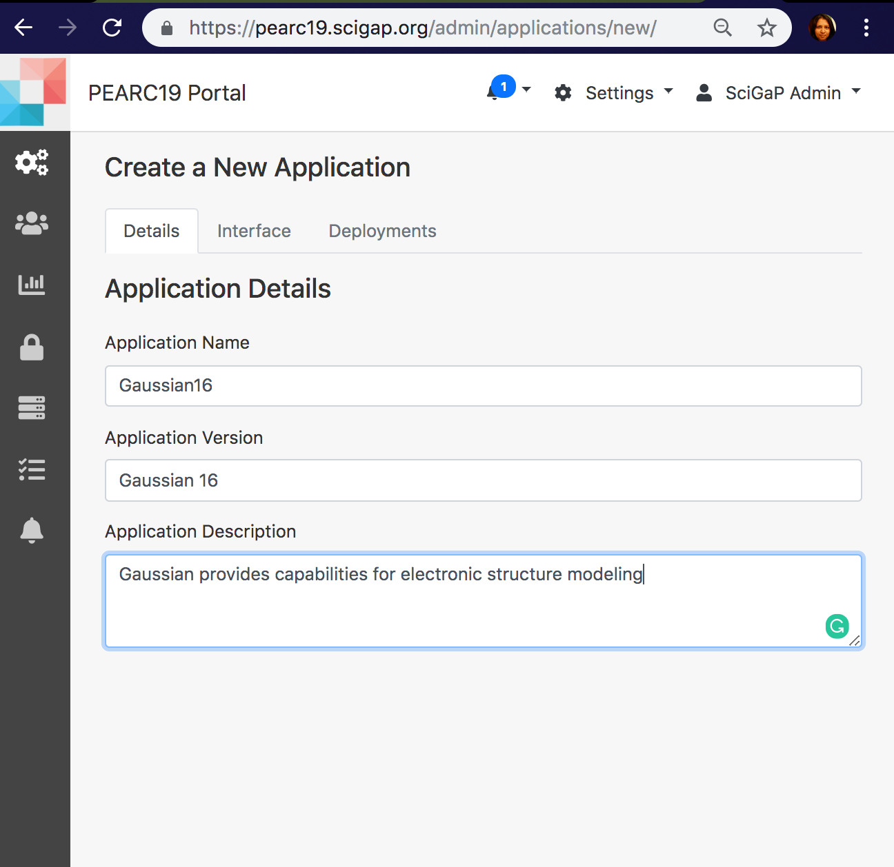
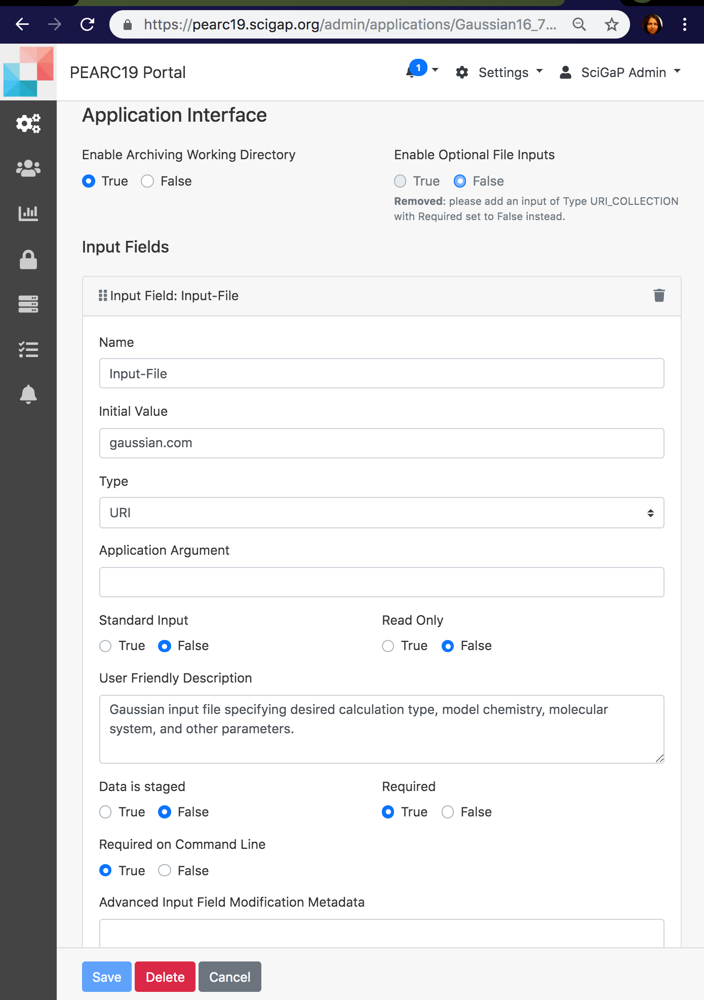
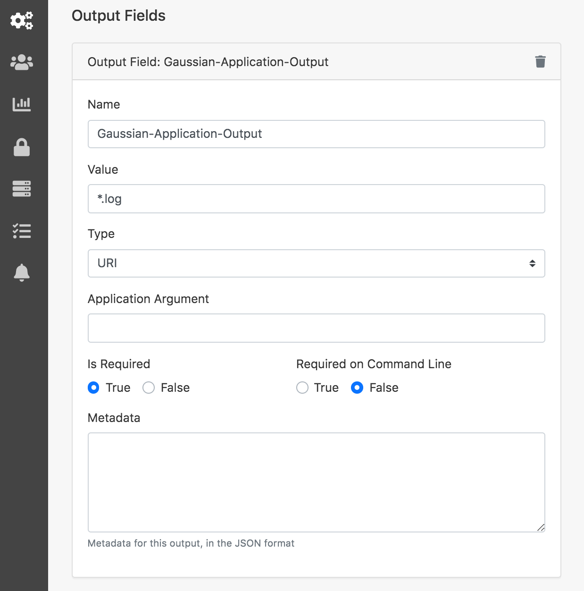
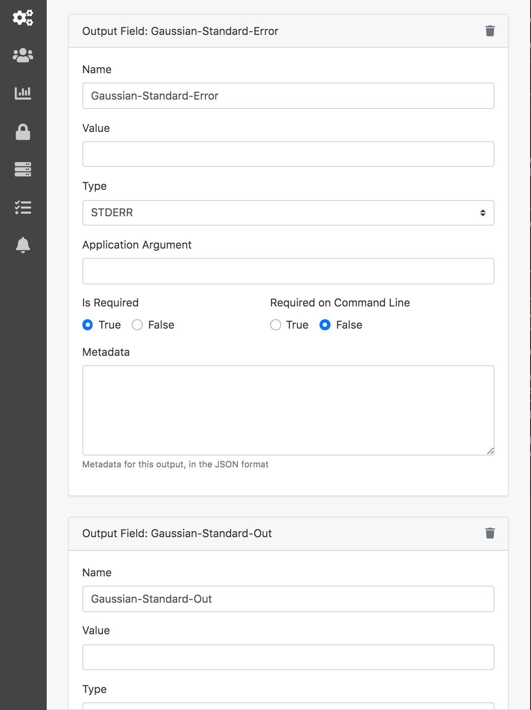
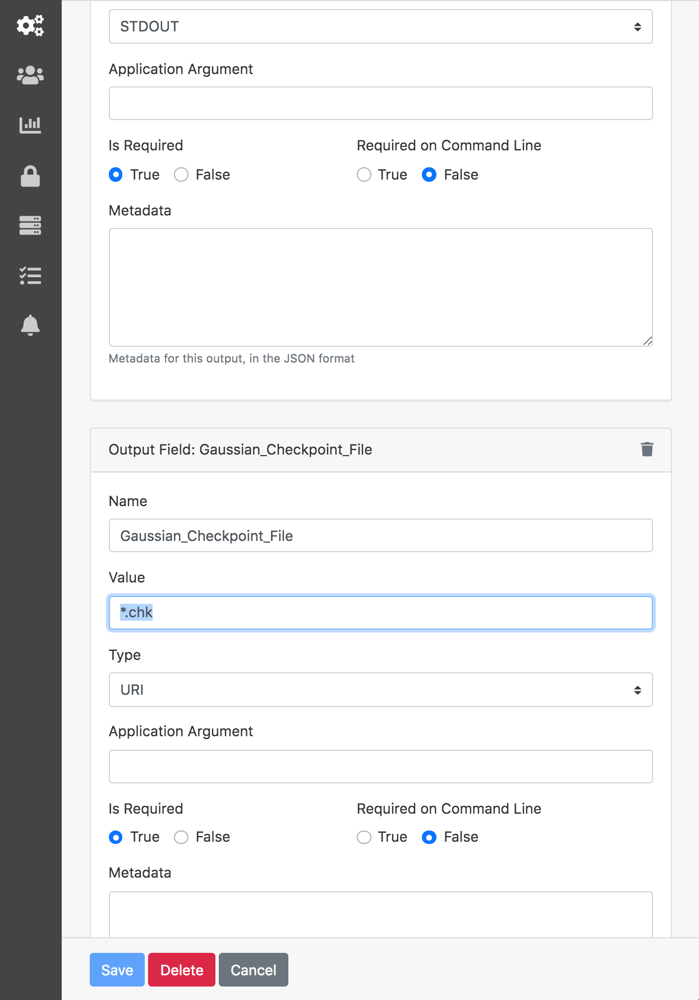
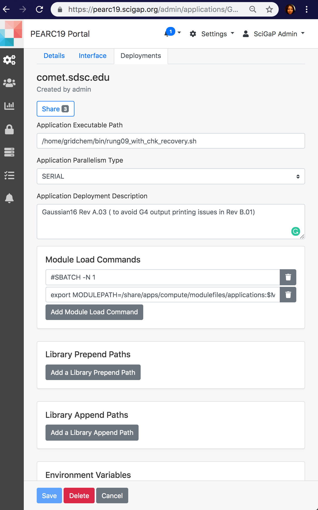

## Gateway Admin Tutorial

###Quick Admin Instructions 
This documentation is a quick set-up instructions for  gateway Settings configurations for Admins. For more details please refer to tutorials provide as well.
<a href="https://cwiki.apache.org/confluence/display/AIRAVATA/Django+Portal+for+Airavata%3A+Gateway+Admin+Guide" target="_blank"> Django Portal Admin Instructions</a>

## Gateway Admin Tutorials
### Prior to starting your configurations
1. You need to have admin access to the Django portal, Settings. You need to be a member of the Admin Group.
    - How to check?
        - Log in to the gateway portal
        - You would land on Dashboard with all the applications you have access to launch jobs.
        - Click 'Settings' from top right drop down menu.
        - Do you see icon 'Application Catalog' ? In it can you create applications using 'New Application +'?.
        - Then you are good ! 
    - If not, contact your gateway admin OR SciGaP team 
<!--3. Credentials generated, assigned and added to authorized_keys files of compute resources -->
<!--- To generate key refer [Credential Store](../configuration/pga-configuration.md#credential-store)-->
<!--    - Token Assignment [Gateway Management](../configuration/pga-configuration.md#gateway-management-of-resources)-->
<!--    - Copy the public key for the assigned token frm credential store and add it to authorized_keys file in both compute and storage resources.-->

<!--NOTE: If you are using a hosted gateway the 2 and 4 would be taken cared by the SciGaP team. -->

### Select Your Quick Start Tutorial
1. <a href= "#Secure">Using Credential Store</a> 
2. <a href= "#Resources">Register your Compute & Storage Resources</a>  
3. <a href= "#GroupResourceProfile">Configure Group Resource Profile (GRP)</a> 
4. <a href="#GaussianJob">Register Gaussian Application</a> 
8. <a href= "#StorePreference">Gateway Resource Profile</a> 
9. <a href= "#GtwyAccess">Managing User Accounts & User Groups</a> 
10. <a href= "#Notices">Communication with Gateway Users</a> 
11. <a href= "#Traffic">Monitor Gateway Traffic</a> 

##### <h5 id="Secure">Using Credential Store</h5>
1. Navigate to Settings &rarr; Credential Store.
2. Click 'New SSH Credential +' and provide a key description.
3. The new key will be generated and available to copy.
4. Apart from using the key for SSH communications with compute resources and gateway storage resource, you can share the key with other gateway users and user groups.
5. When sharing a key, there are 3 permission levels, READ, WRITE and MANAGE_SHARING. 
6. READ permission enables the users to use the key, WRITE permission enables using the key plus deleting the key. MANAGE_SHARING is use the key, delete it and also share with other users and user groups behalf of the owner of the key.
7. NOTE: Make sure not to delete once assigned to a compute resource or the storage resource.  

##### <h5 id="Resources">Register your Compute & Storage Resources</h5> 

<b class="lred"> NOTE:</b> Only SciGaP admins or gateway service provider can add compute resources and storage resources.   If the gateway and middleware is hsoted by you, You can add the Compute Resources and Storage Resource.
  <b>What is a compute resource? </b> A compute resource is an object that represents a host, host cluster, or pool in a virtualization platform, a virtual data center, or an Amazon region on which machines can be provisioned. 
 Compute resource could come as national resources, campus resources or even private cluster. 
 NOTE:For testing purposes users (mainly gateway developers) this could even be the local machine.
  <b>What is a storage resource?</b> A storage resource is the server that stores all user data files: application input files and output files. 
 Most of the time this is the same server that the gateway is deployed in. The storage resource can be either provided by the gateway provider or by you. 
 If the gateway service provider is providing the resource, then there will be file retention policies in place.

###### <b><u>Compute Resource Information </u></b>
Provide the information below to get your compute resource/HPC registered with Super admin portal, <a href="https://scigap.org/" target="_blank">SciGaP</a> 
1. HPC Name (This is the name used to SSH to the resource) 
2. Queue details (Queue name, maximum limits of nodes, CPUs and Walltime.) 
3. Resource manager type (SLURM, PBS) 
4. Job command binary path  

###### <b><u>Register a XSEDE Resource </u></b>
NOTE: Please note this set of instructions are ONLY for gateways hosted by the user. If not SciGaP admins will do this configuration for you in <a href="https://scigap.org/" target="_blank">SciGaP Portal</a>.  
1. Navigate to Admin Dashboard &rarr; Compute Resource &rarr; Register  
2. Provide
    - Host Name: comet.sdsc.edu 
    - Host Aliases:  
    - IP Addresses: 
    - Resource Description: SDSC Comet Cluster ( Just a description) 
    - Create 
3. In Queues tab 
    - Click 'Add a Queue' 
    - Queue 1
        - Queue Name: compute ( Per resource this is a unique value. Once created cannot edit the name. If need to change, delete and create again) 
        - Queue Description: Used for access to regular compute nodes 
        - Queue Max Run Time (In Minutes): 280 (Note required for the local resource) 
        - Queue Max Nodes: 72 (Note required for the local resource) 
        - Queue Max Processors: 1728 (Note required for the local resource) 
        - Max Jobs in Queue: 0 (Note required for the local resource) 
        - Max Memory For Queue( In MB ): (Note required for the local resource) 
    - Queue 2
        - Queue Name: shared ( Per resource this is a unique value. Once created cannot edit the name. If need to change, delete and create again) 
        - Queue Description: Single-node jobs using fewer than 24 cores 
        - Queue Max Run Time (In Minutes): 2880 (Note required for the local resource) 
        - Queue Max Nodes: 1 (Note required for the local resource) 
        - Queue Max Processors: 24 (Note required for the local resource) 
        - Max Jobs in Queue: 0 (Note required for the local resource) 
        - Max Memory For Queue( In MB ): (Note required for the local resource) 
4. File System 
    - Nothing to add here, this is futuristic development. 
5. Job Submission Interface 
    - Click on the tab 
    - Add a new Job Submission Interface 
    - Job Submission Protocol: SSH 
    - Select Security Protocol: SSH_KEYS
    - SSH Port: 22
    - Select resource manager type: SLURM 
    - Job Manager Bin Path: /usr/bin/
    - Job Commands (SUBMISSION): sbatch 
    - Job Commands (JOB_MONITORING): squeue 
    - Job Commands (DELETION): scancel 
    - Parallelism Prefixes (MPI): mpiexec  
    - Add Job Submission Protocol 
6.  Data Movement Interface 
    - Add a new Data Submission Interface 
    - Data Movement Protocol: SCP 
    - Select Security Protocol: SSH_KEYS  
    - SSH Port: 22  
    - Add Data Movement Protocol 
Now the Local resource is ready for job submissions. 
Comet is ready for job submissions.     

###### <b><u>Register a Campus Resource </u></b>
NOTE: Adding a campus resource is similar to adding a XSEDE resource. Same steps to follow with similar information.

###### <h6 id="StoreR"><b><u>Register Storage Resource</u></b></h6>
NOTE: Please note this set of instructions are ONLY for gateways hosted by the user. If not SciGaP admins will do this configuration for you in <a href="https://scigap.org/" target="_blank">SciGaP Portal</a>.  
1. Navigate to Admin Dashboard &rarr; Storage Resource &rarr; Register  
2. Provide  
    - Host Name: sg03.iu.xsede.org 
    - Storage Resource Description: Storage for airavata gateway 
    - Create 
3. In Data Movement Interfaces tab 
    - Click 'Add a new Data Movement Interface' 
    - Select 'SCP' from the list 
    - Select Security Protocol: SSH_KEYS 
    - Alternate SSH Host Name: Leave empty 
    - SSH Port: 22 
    - Add Data Movement Interface 

#####<h5 id="GroupResourceProfile">Add a Group Resource Profile for Comet (GRP)</h5>
1. What is a group resource profile?
    - Group resource profile is a configuration which states how a particular HPC resource (campus, national, cloud) is available for users to use. 
    - One or many HPCs can be added to a GRP and then it can be shared with the users and user groups to enable use.
    - A gateway can have multiple GRPs and a gateway user can be in one or many GRPs
    - At the time of experiment creation, user need to select which GRP to move forward to launch experiment jobs.
2.  To Create a GRP
    - Navigate to Settings &rarr; Group Resource Profile.
    - Click New Group Resource Profile +.
    - Add Name: Default Gateway Profile
    - Default SSH Credential: Select a key from the list or generate a new one.
    - Click New Compute Resource +.
    - Select the resource from the list provided.
        - In next page provide the details required for SSH communication
        - Login Username: This is the login name to use in SSH login
        - SSH Credential: Select from the list, or generate a new one
        - Allocation Project Number: this is applicable for resources which maintains an account for user allocation and usage. 
        - Scratch Location: The location for users' computational working directories
    - Provide computational queue policies
        - This section will provide details of maximum node, walltime and CPUs per HPC resource that a gateway user could use in experiment creation.
        - If you don't specify these limits, then the maximum allowed from the HPC resource will be available for users.
        - NOTE: This feature is more popular with gateways which are used in educational purposes and also for gateways where the gateway admin provides XSEDE resoruces for free via community allocations.
        - Click Save
        - Next page, click Save
    

#####<h5 id="GaussianJob">Register Gaussian Application</h5>
End of this tutorial you will know how to register a new application to run on a a HPC resource through Django portal.

1. Navigate to Settings &rarr; Application Catalog. Click New Application +
2. In Details tab enter:
    - Enter Application Name: Gaussian16
    - Enter Application Version: Gaussian 16 (Not mandatory)
        - Enter Application Description: Gaussian provides capabilities for electronic structure modeling
    - Save

3. In Interface tab:
    - Set 'Enable Archiving Working Directory' to True (Why? - This is set to true when you want to bring back all the files in working directory back to PGA. Caution: If there are very large files they may not be able to SCP)
    - Set 'Enable Optional File Inputs' to False (Why? - Set to false because there won't be any additional optional inputs for Gaussian)
    - Provide Input Fields
        - Click Add Application Input
        - Name: Input-File
        - Initial Value: gaussian.com
        - Type: URI (Why? - This is the type for file uploads)
        - Application Arguments:
        - Standard Input: False (Why? - Futuristic property and not in real use at the moment)
        - Read Only: False (Why? - this is only meaningful for String, Integer or Float inputs)
        - User Friendly Description: Gaussian input file specifying desired calculation type, model chemistry, molecular system and other parameters. (This is information to the user at creating job experiment. Not mandatory)
        - Data is Staged: False
        - Is the Input Required: True
        - Required in Commandline: True
        - Advanced Input Field Modification Metadata:
    - Provide application outputs 
    NOTE: 3 application outputs to define.  
        - 1st Output
            - Click Add Application Output
            - Name: Gaussian-Application-Output
            - Value: *.log
            - Type: URI
            - Application Argument:
            - Is the Output required?: True
            - Required on command line?: True
            - Metadata: 
        - 2nd output
            - Click Add Application Output
            - Name: Gaussian_Checkpoint_File
            - Value: *.chk
            - Type: URI
            - Application Argument:
            - Data Movement: False
            - Is the Output required?: True
            - Required on command line?: True
            - Metadata
        - For applications, STDOUT and STDERR will be automatically added for you.
            - Search Query: 

  
3. In Deployment tab
    - Click 'New Deployment +'
        - Click Share and add groups and users you want to share this deployment and let run on the particular cluster.
        - Application Executable Path: /home/gridchem/bin/rung09_with_chk_recovery.sh
        - Application Parallelism Type: SERIAL  
        - Application Deployment Description: Gaussian16 Rev A.03 ( to avoid G4 output printing issues in Rev B.01)
        - Application Compute Host: Local (Local machine has to be added as a compute resource prior to this step)
        - Add Module load commands: 
            - <pre><code>#SBATCH -N 1</code></pre>
            - export MODULEPATH=/share/apps/compute/modulefiles/applications:$MODULEPATH; module load gaussian/16.B.01
        - Pre Job Commands:
            - export AIRAVATA_USERNAME=$gatewayUserName
            - export AIRAVATA_INPUTS=$inputs
            - export AIRAVATA_ExptDataDir=$experimentDataDir;
        - Default Queue Name: shared
        - Default Node Count: 1
        - Default CPU Count: 4
        - Default Walltime: 30

##### <h5 id="StorePreference">Gateway Resource Profile </h5>
1. NOTE: This is the section to configure the storage resource for the gateway. Storage resource is the place to hold all gateway user data: inputs and outputs from computations. 
2. Navigate to Settings &rarr; Gateway Resource Profile.
3. Select a SSH key from the list or generate  new one and assign it.
4. Click: New Storage Preference +.
5. Select Storage Resource: This is the storage resource for the user files and generally its the same server that holds the Django portal. If the gateway is deployed for you, this part would be taken cared by the SciGaP team. If the gateway is self-deployed select the host name of the server you deployed the gateway.
6. Login Username: pga (This is the username which uses to ssh to the storage resource)
7. File System Root Location: /var/www/portals/gateway-user-data/seagrid (The path which stores all user files, input files and output files)
8. Resource Specific Credential Store Token: Select a token from the list. (Public key of this token need to be added to authorized_keys in your storage resource 'pga' login)
9. Save.

##### <h5 id="GtwyAccess">Managing User Accounts & User Groups</h5> 
1. Read: [User Groups](airavata-user-profiles.md)
2. To manage gateway users access use, Groups from top right-hand dropdown.
3. Click 'Edit' on the group you want to add users.
4. Mostly the users are added to Gateway-user group by the gateway admins.
4. Search for the user account using search text field.
5. The name entered, will be searched across username, first name, last name and email.
6. User with the matching search string will be listed in the dropdown.
8. Select the user account, it will get added in to the list highlighted in green.
9. By default users are added with Member role.
10. Using the Groups interface, searching for already added users, deleting existing users and changing their roles are supported.

##### <h5 id="Notices">Communication with Gateway Users</h5> 
1. Provides a method to notify the gateway user.
2. When user logs in, a 'Bell' icon will be displayed with the number of unread messages next to Dashboard on top menu bar.
3. Gateway admin can create these notices with an assigned priority.
4. navigate to Settings &rarr; Manage Notices
5. Click 'New Notice +'
6. Provide:
    - Notice Title: Gordon cluster is retiring (A heading for the notice)
    - Notice Message: Gordon cluster is retiring from Dec 31st 2016. Preserve your files now.
    - Publish Date: Select from the provided calendar
    - Expiration Date: Mandatory.
    - Priority: LOW (Default is 'LOW'. Admin can change)   

    

##### <h5 id="Traffic">Monitor Gateway Traffic</h5> 
1. To monitor current gateway experiment and job statuses navigate to Settings &rarr; Experiment Statistics.
2. Gateway admin can view and filter experiments of the gateway using this page.
3. In experiment statistics page, by default gateway status for last 24 hours will be displayed.
4. Two buttons, 'Past 24 Hours' and 'Past Week' will group and list the experiments for the selected time.
5. In order to further filter the experiments use, Filters dropdown.
    - Username: AnneMarie (Gateway username need to be typed in)
    - Application Name: Gaussian (All the application in teh gateway will be listed)
    - Hostname: Comet.sdsc.edu (A drop down will provide all the compute resources to select from)
    - Click 'Get Statistics'
6. Using the calendar, you can search experiments for a time duration you need. 
7. Once the experiments are filtered and grouped, click on the desired group (Existing experiments groups are 'Total','Created','Running', Completed','Cancelled' and 'Failed').
8. When you list an experiment group you can select the experiment you want to view using 'View Details'. This will open the experiment Details Summary in a new tab.
