## Admin Settings Configurations

This page is dedicated to Gateway Admins!

### Prior to starting your configurations
1. You need to have admin access to the Django portal, Settings. You need to be in 'Admin' role of the Admin Group.
    - How to check?
        - Log in to the gateway portal
        - You would land on Dashboard with all the applications you have access to launch jobs.
        - Click 'Settings' from top right drop down menu.
        - Do you see icon 'Application Catalog' ? In it can you create applications using 'New Application +'?.
        - Then you are good !
3. Credentials generated, assigned and added to authorized_keys files of resources
    - To generate key refer [Credential Store](../configuration/pga-configuration.md#credential-store)
    - Token Assignment [Gateway Management](../configuration/pga-configuration.md#gateway-management-of-resources)
    - Copy the public key for the assigned token frm credential store and add it to authorized_keys file in both compute and storage resources.

NOTE: If you are using a hosted gateway the 2 and 4 would be taken cared by the SciGaP team.

### Select Your Quick Start Tutorial
1. <a href= "#Resources">Register your Compute & Storage Resources</a>  
2. <a href="#GaussianJob">Gaussian Job Submission to Comet (XSEDE resource)</a> 
3. <a href="#LocalJob">Running Echo on Local Machine</a> 
4. <a href="#PrePostCommands">Add Pre and Post Job Commands for an Application</a> 
5. <a href="#SampleApp">Add Environment Variables for an Application Deployment</a> 
6. <a href= "#Secure">Using Credential Store</a> 
7. <a href= "#Preference">Gateway Preference Management</a> 
8. <a href= "#GtwyAccess">Managing User Accounts</a> 
9. <a href= "#Notices">Communication with Gateway Users</a> 
10. <a href= "#Traffic">Monitor Gateway Traffic</a> 
11. <a href="https://cwiki.apache.org/confluence/display/AIRAVATA/Tutorial+05+-+PHP+Reference+Gateway+for+Airavata+-+Gateway+Admin+Guide" target="_blank"> PGA Portal Admin Tutorial</a>

##### <h5 id="Resources">Register your Compute & Storage Resources</h5> 
###### <b><u>Register Local Resource </u></b>
<b class="lred"> NOTE:</b> Only Super gateway admins can add compute resources and storage resources.   Gateway need to be hsoted locally and have access to Compute Resources &rarr; Register  
 <b>What is a compute resource? </b> A compute resource is an object that represents a host, host cluster, or pool in a virtualization platform, a virtual data center, or an Amazon region on which machines can be provisioned. 
 Compute resource could come as national resources, campus resources or even private cluster. 
 NOTE:For testing purposes users (mainly gateway developers) this could even be the local machine.

1. Navigate to Admin Dashboard &rarr; Compute Resource &rarr; Register  
2. Provide
    - Host Name: Local Resource 
    - Host Aliases:  
    - IP Addresses: 
    - Resource Description: My local resource for application execution ( Just a description) 
    - Create 
3. In Queues tab  (A queue is not required ideally, but as per the gateway logic, queue is required)
    - Click 'Add a Queue' 
    - Queue Name: Normal ( Per resource this is a unique value. Once created cannot edit the name. If need to change, delete and create again) 
    - Queue Description: Local resource normal for job submission 
    - Queue Max Run Time (In Minutes): (Note required for the local resource) 
    - Queue Max Nodes: (Note required for the local resource) 
    - Queue Max Processors: (Note required for the local resource)   
    - Max Jobs in Queue: (Note required for the local resource) 
    - Max Memory For Queue( In MB ): (Note required for the local resource) 
4. File System 
    - Nothing to add here, this is futuristic development. 
5. Job Submission Interface 
    - Click on the tab 
    - Add a new Job Submission Interface 
    - Job Submission Protocol: Local 
    - Select resource manager type: FORK 
    - Job Commands (SUBMISSION): /bin/sh 
    - Add Job Submission Protocol 
6.  Data Movement Interface 
    - Add a new Data Submission Interface 
    - Data Movement Protocol: Local 
    - Add Job Submission Protocol 
Now the Local resource is ready for job submissions. 

###### <b><u>Register a XSEDE Resource </u></b>
1. Navigate to Admin Dashboard &rarr; Compute Resource &rarr; Register  
2. Provide
    - Host Name: comet.sdsc.edu 
    - Host Aliases:  
    - IP Addresses: 
    - Resource Description: SDSC Comet Cluster ( Just a description) 
    - Create 
3. In Queues tab 
    - Click 'Add a Queue' 
    - Queue 1
        - Queue Name: compute ( Per resource this is a unique value. Once created cannot edit the name. If need to change, delete and create again) 
        - Queue Description: Used for access to regular compute nodes 
        - Queue Max Run Time (In Minutes): 280 (Note required for the local resource) 
        - Queue Max Nodes: 72 (Note required for the local resource) 
        - Queue Max Processors: 1728 (Note required for the local resource) 
        - Max Jobs in Queue: 0 (Note required for the local resource) 
        - Max Memory For Queue( In MB ): (Note required for the local resource) 
    - Queue 2
        - Queue Name: shared ( Per resource this is a unique value. Once created cannot edit the name. If need to change, delete and create again) 
        - Queue Description: Single-node jobs using fewer than 24 cores 
        - Queue Max Run Time (In Minutes): 2880 (Note required for the local resource) 
        - Queue Max Nodes: 1 (Note required for the local resource) 
        - Queue Max Processors: 24 (Note required for the local resource) 
        - Max Jobs in Queue: 0 (Note required for the local resource) 
        - Max Memory For Queue( In MB ): (Note required for the local resource) 
4. File System 
    - Nothing to add here, this is futuristic development. 
5. Job Submission Interface 
    - Click on the tab 
    - Add a new Job Submission Interface 
    - Job Submission Protocol: SSH 
    - Select Security Protocol: SSH_KEYS
    - SSH Port: 22
    - Select resource manager type: SLURM 
    - Job Manager Bin Path: /usr/bin/
    - Job Commands (SUBMISSION): sbatch 
    - Job Commands (JOB_MONITORING): squeue 
    - Job Commands (DELETION): scancel 
    - Parallelism Prefixes (MPI): mpiexec  
    - Add Job Submission Protocol 
6.  Data Movement Interface 
    - Add a new Data Submission Interface 
    - Data Movement Protocol: SCP 
    - Select Security Protocol: SSH_KEYS  
    - SSH Port: 22  
    - Add Data Movement Protocol 
Now the Local resource is ready for job submissions. 
Comet is ready for job submissions.     

###### <b><u>Register a Campus Resource </u></b>
NOTE: Adding a campus resource is similar to adding a XSEDE resource. Same steps to follow with similar information.

###### <h6 id="StoreR"><b><u>Register Storage Resource</u></b></h6>
1. Navigate to Admin Dashboard &rarr; Storage Resource &rarr; Register  
2. Provide
    - Host Name: sg03.iu.xsede.org
    - Storage Resource Description: Storage for airavata gateway
    - Create
3. In Data Movement Interfaces tab
    - Click 'Add a new Data Movement Interface'
    - Select 'SCP' from the list
    - Select Security Protocol: SSH_KEYS
    - Alternate SSH Host Name: Leave empty
    - SSH Port: 22
    - Add Data Movement Interface
4. A single storage resource is sufficient for gateway which users PGA for all job submissions.

#####<h5 id="GaussianJob">Gaussian Job Submission to Comet  (XSEDE resource)</h5>
This is a tutorial to configuring and running an application on XSEDE resource through PGA portal.

1. Create new application module: Gaussian
    - Navigate to Admin Dashboard &rarr; App Catalog &rarr; Application Module 
    - Click Create a new Application Module
    - Enter Application Module Name: Gaussian
    - Enter Application Module Version: Gaussian 09 (Not mandatory)
    - Enter Description: Gaussian provides capabilities for electronic structure modeling
    - Create
    - This create the Gaussian module  
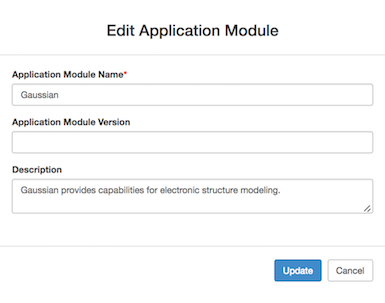
2. Create the application interface: Gaussian
    - Navigate to Admin Dashboard &rarr; App Catalog &rarr; Application Interface
    - Click 'Create new Application Interface'
    - Add Application Name: Gaussian
    - Add Application Description: Gaussian provides capabilities for electronic structure modeling
    - Select Application Module: Gaussian ( If multiple modules are using same interface here you can add multiple modules. Ex: Gaussian 03 and Gaussian 09 modules)
    - Set 'Enable Archiving Working Directory' to True (Why? - This is set to true when you want to bring back all the files in working directory back to PGA. Caution: If there are very large files they may not be able to SCP)
    - Set 'Enable Optional File Inputs' to False (Why? - Set to false because there won't be any additional optional inputs for Gaussian)
    - Provide application inputs
        - Click Add Application Input
        - Name: Input-File
        - Value: 
        - Type: URI (Why? - This is the type for file uploads)
        - Application Arguments:
        - Standard Input: False (Why? - Futuristic property and not in real use at the moment)
        - User Friendly Description: Gaussian input file specifying desired calculation type, model chemistry, molecular system and other parameters. (This is information to the user at creating job experiment. Not mandatory)
        - Input Order: 1
        - Data is Staged: False
        - Is the Input Required: True
        - Required in Commandline: True
        - Meta Data:
    - Provide application outputs 
    NOTE: 3 application outputs to define.  
        - 1st Output
            - Click Add Application Output
            - Name: Gaussian-Application-Output
            - Value: Gaussian.log
            - Type: URI
            - Application Argument:
            - Data Movement: True
            - Is the Output required?: True
            - Required on command line?: True
            - Location:
            - Search Query: 
        - 2nd output
            - Click Add Application Output
            - Name: Gaussian-Standard-Out
            - Value:
            - Type: STDOUT
            - Application Argument:
            - Data Movement: False
            - Is the Output required?: True
            - Required on command line?: True
            - Location:
            - Search Query: 
        - 3rd output
            - Click Add Application Output
            - Name: Gaussian-Standard-Error
            - Value:
            - Type: STDERR
            - Application Argument:
            - Data Movement: False
            - Is the Output required?: True
            - Required on command line?: True
            - Location:
            - Search Query: 
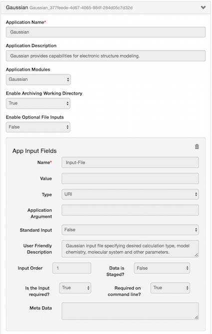
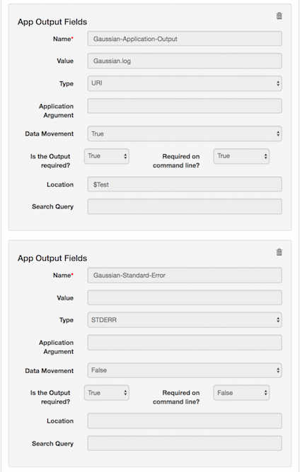
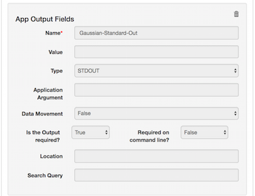
  
3. Create the application deployment: Gaussian on Comet
    - Navigate to Admin Dashboard &rarr; App Catalog &rarr; Application Deployment
    - Click 'Create new Application Deployment'
        - Application Module: Gaussian
        - Application Compute Host: comet.sdsc.edu (Your comet specific gateway preferences need to be added in 'Gateway Management' prior to this)
        - Application Executable Path: g09
        - Application Parallelism Type: SERIAL
        - Application Deployment Description: Gaussian provides capabilities for electronic structure modeling.
        - Module Load Commands: module load gaussian
        - Post Job Commands: mkdir -p "$PWD"_restart; cp *.chk ${pwd}_restart; mv *.rwf* ${pwd}_restart; (Why? - any command you would want to execute after post job execution) 

#####<h5 id="LocalJob">Running Echo on Local Machine</h5>
Quickest way to confirm Airavata and PGA setup. This will tell you what you need to do to Echo a simple 'Hello World' in your local machine.

1. Create new application module: Echo
    - Navigate to Admin Dashboard &rarr; App Catalog &rarr; Application Module 
    - Click Create a new Application Module
    - Enter Application Module Name: Echo
    - Enter Application Module Version: Echo 1.0 (Not mandatory)
    - Enter Description: Echo application for testing
    - Create
    - This create the Echo module  
   
2. Create the application interface: Echo
    - Navigate to Admin Dashboard &rarr; App Catalog &rarr; Application Interface
    - Click 'Create new Application Interface'
    - Add Application Name: Echo
    - Add Application Description: Echo Interface for testing
    - Select Application Module: Echo
    - Set 'Enable Archiving Working Directory' to False (Why? - This is set to true if you want to bring back all the files in working directory back to PGA)
    - Set 'Enable Optional File Inputs' to False (Why? - Set to false because there won't be any additional optional inputs for Echo)
    - Provide application inputs
        - Click Add Application Input
        - Name: Input-to-Echo
        - Value: Echo Test 1......2......3....... (This value can be overridden at experiment creation)
        - Type: STRING
        - Application Arguments:
        - Standard Input: False (Why? - Futuristic property and not in real use at the moment)
        - Is Read Only: False (Why? - When this is set to true the input value will only be 'read-only'. User cannot change at experiment creation,edit or clone).
        - User Friendly Description: Enter STRING input for Echo (Not mandatory)
        - Input Order: 1
        - Data is Staged: True
        - Is the Input Required: True
        - Required in Commandline: True
        - Meta Data:
    - Provide application outputs
    NOTE: 3 application outputs to define. 
        - 1st output
            - Click Add Application Output
            - Name: Echo-Standard-Out
            - Value:
            - Type: STDOUT
            - Application Argument:
            - Data Movement: False
            - Is the Output required?: True
            - Required on command line?: True
            - Location:
            - Search Query: 
        - 2nd output
            - Click Add Application Output
            - Name: Echo-Standard-Error
            - Value:
            - Type: STDERR
            - Application Argument:
            - Data Movement: False
            - Is the Output required?: True
            - Required on command line?: True
            - Location:
            - Search Query: 

  
3. Create the application deployment: Echo on Local Machine
    - Navigate to Admin Dashboard &rarr; App Catalog &rarr; Application Deployment
    - Click 'Create new Application Deployment'
        - Application Module: Echo
        - Application Compute Host: Local (Local machine has to be added as a compute resource prior to this step)
        - Application Executable Path: /home/airavata/ECHO/echo_wrapper.sh (Local to where you have airavata installed)
        - Application Parallelism Type: SERIAL  

4. echo_wrapper.sh contains;
<pre><code>
    #!/bin/bash
    #sleep 10
    echo "Echoed_Output="${@:1:($#-2)}"" >> "${@:(-1):1}" 2>> "${@:(-2):1}"
</code></pre>

##### <h5 id="PrePostCommands">Add Pre and Post Job Commands for an Application</h5>
- This tutorial demonstrates use of pre and post job commands and how they appear in job submission script.  
- For application executions we would require to use pre and post job commands. 
- In this tutorial we are using an application which has both pre and post job commands in use. Existence of pre and post job commands could be application specific or specific to the application residing compute resource.

###### <b><u>NEK5000 </u></b>
1. Create new application module: NEK5000
    - Navigate to Admin Dashboard &rarr; App Catalog &rarr; Application Module 
    - Click Create a new Application Module
    - Enter Application Module Name: NEK5000
    - Enter Application Module Version: (Not mandatory)
    - Enter Description: Open source, highly scalable and portable spectral element code designed to simulate
    - Create
    - This create the NEK5000 module  
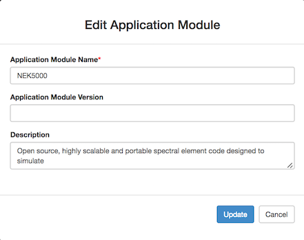
2. Create the application interface: NEK5000
    - Navigate to Admin Dashboard &rarr; App Catalog &rarr; Application Interface
    - Click 'Create new Application Interface'
    - Add Application Name: NEK5000
    - Add Application Description: Open source, highly scalable and portable spectral element code designed to simulate
    - Select Application Module: NEK5000 ( If multiple modules are using same interface here you can add multiple modules. Ex: Gaussian 03 and Gaussian 09 modules)
    - Set 'Enable Archiving Working Directory' to True (Why? - This is set to true when you want to bring back all the files in working directory back to PGA. Caution: If there are very large files they may not be able to SCP)
    - Set 'Enable Optional File Inputs' to False (Why? - Set to false because there won't be any additional optional inputs for NEK5000)
    - Provide application inputs
        - Click Add Application Input
        - 1st Input
            - Name: Basename
            - Value: nek5kbasename
            - Type: STRING (Why? - Input is a string value)
            - Application Arguments:
            - Standard Input: False (Why? - Futuristic property and not in real use at the moment)
            - Is Read Only: True (Why? - This value should not be changed by the gateway user at experiment creation)
            - User Friendly Description:
            - Input Order: 0
            - Data is Staged: False
            - Is the Input Required: True
            - Required in Commandline: True
            - Meta Data:
        - 2nd Input
            - Name: User-Subroutine-File
            - Value: nek5kbasename.usr (Why? - Name of the file upload will be changed to the name given as the value here. Application level requirement)
            - Type: URI
            - Application Arguments:
            - Standard Input: False (Why? - Futuristic property and not in real use at the moment)
            - Is Read Only: False (Why? - This is a URI type input.)
            - User Friendly Description: .usr File (Why? - This provides user with information related to the input file.)
            - Input Order: 1
            - Data is Staged: False
            - Is the Input Required: True
            - Required in Commandline: False
            - Meta Data:
        - 3rd Input
            - Name: Runtime-Parameter-File
            - Value: nek5kbasename.rea (Why? - Name of the file upload will be changed to the name given as the value here. Application level requirement)
            - Type: URI
            - Application Arguments:
            - Standard Input: False (Why? - Futuristic property and not in real use at the moment)
            - Is Read Only: False (Why? - This is a URI type input.)
            - User Friendly Description: .rea File (Why? - This provides user with information related to the input file.)
            - Input Order: 2
            - Data is Staged: False
            - Is the Input Required: True
            - Required in Commandline: False
            - Meta Data:
        - 4th Input
            - Name: Size-for-Memory-Allocation
            - Value:
            - Type: URI
            - Application Arguments:
            - Standard Input: False (Why? - Futuristic property and not in real use at the moment)
            - Is Read Only: False (Why? - This is a URI type input.)
            - User Friendly Description: SIZE File (Why? - This provides user with information related to the input file.)
            - Input Order: 3
            - Data is Staged: False
            - Is the Input Required: True
            - Required in Commandline: False
            - Meta Data:
    - Provide application outputs 
    NOTE: 3 application outputs to define.  
        - 1st Output
            - Click Add Application Output
            - Name: NEK5000-Compilation-Output
            - Value: compiler.out
            - Type: URI
            - Application Argument:
            - Data Movement: False
            - Is the Output required?: True
            - Required on command line?: True
            - Location:
            - Search Query: 
        - 2nd Output
            - Click Add Application Output
            - Name: NEK5000-Output_tarball
            - Value: nek5kbasename.tgz
            - Type: URI
            - Application Argument:
            - Data Movement: False
            - Is the Output required?: True
            - Required on command line?: False
            - Location:
            - Search Query: 
        - 3rd Output
            - Click Add Application Output
            - Name: NEK5000-Session-Out
            - Value: session.log
            - Type: URI
            - Application Argument:
            - Data Movement: False
            - Is the Output required?: True
            - Required on command line?: True
            - Location:
            - Search Query:             
        - 4th output
            - Click Add Application Output
            - Name: NEK5000-Standard-Out
            - Value:
            - Type: STDOUT
            - Application Argument:
            - Data Movement: False
            - Is the Output required?: True
            - Required on command line?: False
            - Location:
            - Search Query: 
        - 5th output
            - Click Add Application Output
            - Name: NEK5000-Standard-Error
            - Value:
            - Type: STDERR
            - Application Argument:
            - Data Movement: False
            - Is the Output required?: True
            - Required on command line?: False
            - Location:
            - Search Query: 
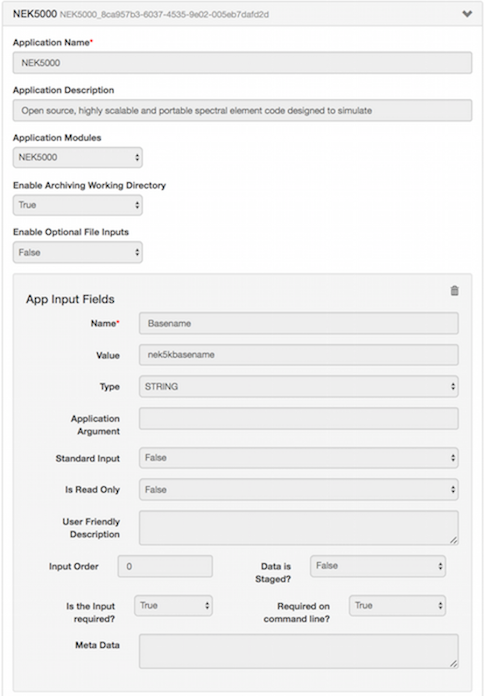
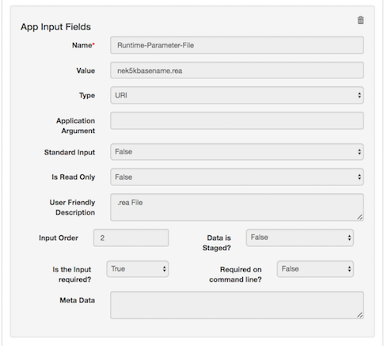
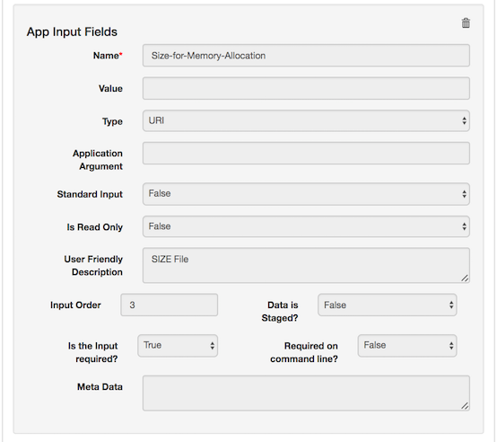
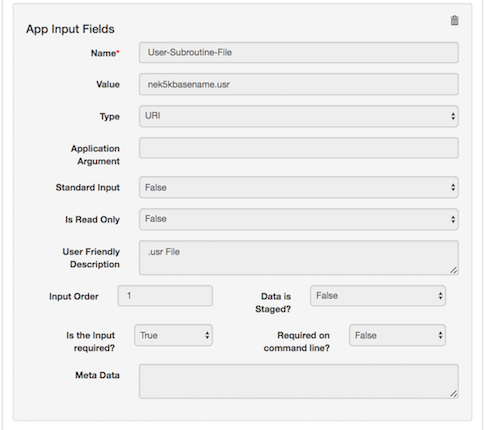
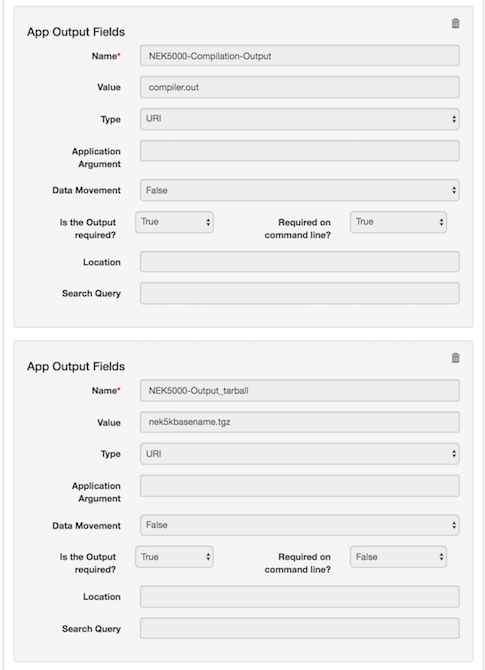
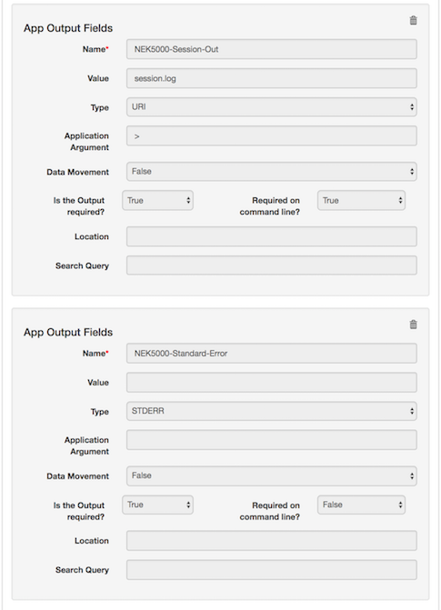
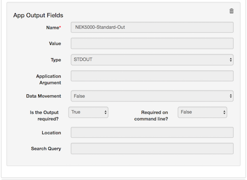
  
3. Create the application deployment: NEK5000 on BigRed2 (BigRed2 is the IU cluster. Using just as an example)
    - Navigate to Admin Dashboard &rarr; App Catalog &rarr; Application Deployment
    - Click 'Create new Application Deployment'
        - Application Module: Gaussian
        - Application Compute Host: bigred2.uits.iu.edu (Your cluster specific gateway preferences need to be added in 'Gateway Management' prior to this)
        - Application Executable Path: ./nek5000
        - Application Parallelism Type: CRAY_MPI
        - Application Deployment Description: Gaussian provides capabilities for electronic structure modeling.
        - Module Load Commands: module swap PrgEnv-cray PrgEnv-gnu; module load nek5000 visit ffmpeg
        - Pre Job Commands: 
            - echo "nek5kbasename" > genmap.in;  echo "0.2" >> genmap.in;
            - echo nek5kbasename  > ./SESSION.NAME; echo 'pwd'/' >>  ./SESSION.NAME;
        - Post Job Commands: 
            - mkdir -p "$PWD"_restart; cp *.chk ${pwd}_restart; mv *.rwf* ${pwd}_restart; (Why? - any command you would want to execute after post job execution) 

4. NEK5000 job script.  Please view the existence and placement of both pre and post job commands in the job script.
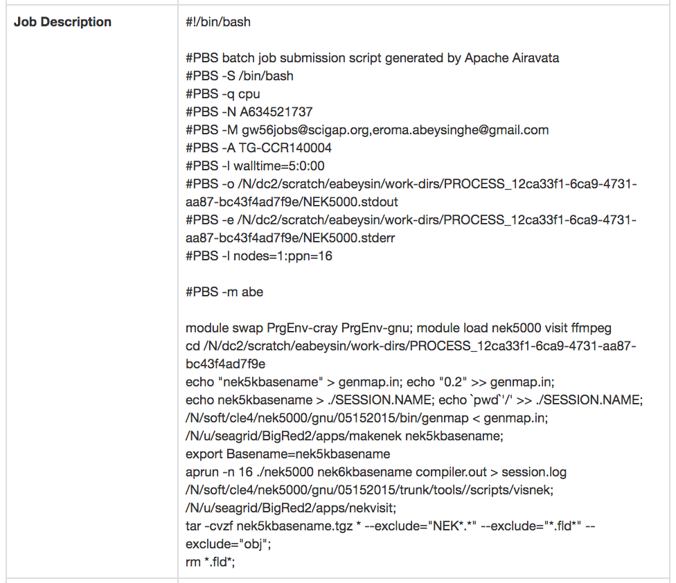

Refer [Application Configuration](../configuration/pga-configuration.md#application-catalog) for more generic details.

##### <h5 id="SampleApp">Add Environment Variables for an Application Deployment</h5>
Work-in-Progress 

##### <h5 id="Secure">Using Credential Store</h5>
1. Navigate to Admin Dashboard &rarr; Credential Store.
2. Click 'Generate a new Token'.
3. A new key+token will be generated.
4. These keys are to use in SSH communications with compute resources and gateway storage resource.
5. NOTE: Make usre not to delete once assigned to a compute resource to a storage resource.

##### <h5 id="Preference">Gateway Preference Management</h5> 
###### <b><u>Gateway Preference for a XSEDE Resource </u></b>
1. Navigate to Admin Dashboard &rarr; Gateway Management
2. Click: Add a Computer Resource Preference
3. Select "comet.sdsc.edu" from the list
4. Provide Data:
    - Override by Airavata: True
    - Login Username: TestUser1 (This is the login username for the comet allocation. Adding at gateway level, this is a community allocation login username)
    - Preferred Job Submission Protocol: SSH
    - Preferred Data Movement Protocol: SCP
    - Preferred Batch Queue: Compute
    - Scratch Location: /oasis/scratch/comet/TestUser1/temp_project/airavata_workdirs (Test scratch location, not an actual. This scratch is also provided with the allocation by XSEDE)
    - Allocation Project Number: test123 (Test project number. Project number of the XSEDE resource need to be added here)
    - Resource Specific Credential Store Token: Select a token from the list. Public key of this token need to be added to authorized_keys in your comet.sdsc.edu allocation)
    - Quality of Service: (If you have a QOS provided from XSEDE, please add here. The format to add: <</pre></code>queue1>=<</pre></code>qos1>, <</pre></code>queue2>=<</pre></code>qos2>)
    - Reservation Name: Not Required
    - Reservation Start Time: Not Required
    - Reservation End Time: Not Required
5. Set preferences.

###### <b><u>Gateway Preference for a Local Resource </u></b>
1. Navigate to Admin Dashboard &rarr; Gateway Management
2. Click: Add a Computer Resource Preference
3. Select "Local Resource" from the list
4. Provide Data:
    - Override by Airavata: True
    - Login Username: (Note required for the local resource)
    - Preferred Job Submission Protocol: Local
    - Preferred Data Movement Protocol: Local
    - Preferred Batch Queue: Normal
    - Scratch Location: /Users/Eroma/working_dirs (This is simply a location in your local machine to have the working directories created and inout and output files written)
    - Allocation Project Number: (Note required for the local resource)
    - Resource Specific Credential Store Token: (Note required for the local resource)
    - Quality of Service: (Note required for the local resource)
    - Reservation Name: (Note required for the local resource)
    - Reservation Start Time: (Note required for the local resource)
    - Reservation End Time: (Note required for the local resource)
5. Set preferences.

###### <b><u>Gateway Preference for the Storage Resource </u></b>
1. Navigate to Admin Dashboard &rarr; Gateway Management.
2. Click: Add a Storage Resource Preference.
3. Select "sg03.iu.xsede.org" from the list (This is the resource you added above in <a href="#StoreR">Register Storage Resource</a>)
4. Provide Data:
    - Login Username: pga (This is the username which uses to ssh to the storage resource)
    - File System Root Location: /var/www/portals/gateway-user-data/seagrid (The path which stores all user files, input files and output files)
    - Resource Specific Credential Store Token: Select a token from the list. (Public key of this token need to be added to authorized_keys in your sg03.iu.xsede.org 'pga' allocation)
5. Set preferences.

##### <h5 id="GtwyAccess">Managing User Accounts</h5> 
1. Read: [User roles](airavata-user-profiles.md)
2. To manage gateway users access use, Admin Dashboard &rarr; Users
3. List users per user role by selecting the role from Role list.
4. Search for the user account using search text field.
5. Can search using 
    - First Name
    - Last Name
    - Username
    - Email
6. User with the matching search string will be listed.
7. Click 'Check roles'
8. Add one or many roles selecting from the list and click Add roles. 
9. Remove already existing roles.

##### <h5 id="Notices">Communication with Gateway Users</h5> 
1. Provides a method to notify the gateway user.
2. When user logs in, a 'Bell' icon will be displayed with the number of unread messages next to Dashboard on top menu bar.
3. Gateway admin can create these notices with an assigned priority.
4. navigate to Admin Dashboard &rarr; Notices
5. Click 'Create a New Notice'
6. Provide:
    - Notice Title: Gordon cluster is retiring (A heading for the notice)
    - Notice Message: Gordon cluster is retiring from Dec 31st 2016. Preserve your files now.
    - Publish Date: Select from the provided calendar
    - Expiration Date: Not mandatory, if needed select from the provided calendar.
    - Priority: LOW (Default is 'LOW'. Admin can change)   
7. Mandatory fields are marked with a *
    

##### <h5 id="Traffic">Monitor Gateway Traffic</h5> 
1. To monitor current gateway experiment and job statuses navigate to Admin Dashboard &rarr; Experiment Statistics.
2. Gateway admin can view and filter experiments of the gateway using this page.
3. In experiment summary by default gateway status for last 24 hours will be displayed.
4. Two buttons, 'Get Experiments from last 24 Hours' and 'Get Experiments from Last Week' will group and list the experiments below for the selected time.
5. In order to further filter the experiments use
    - Username: AnneMarie (Gateway username need to be typed in)
    - Application Name: Gaussian (All the application in teh gateway will be listed)
    - Hostname: Comet.sdsc.edu (A drop down will provide all the compute resources to select from)
    - Click 'Get Statistics'
6. Once the experiments are filtered and grouped, click on the desired group (Existing experiments groups are 'Total','Created','Running', Completed','Cancelled' and 'Failed').
7. When you list an experiment group you can select the experiment you want to view either in Experiment Summary (Click on Status) or in Details Summary (Click on Check Stats).
