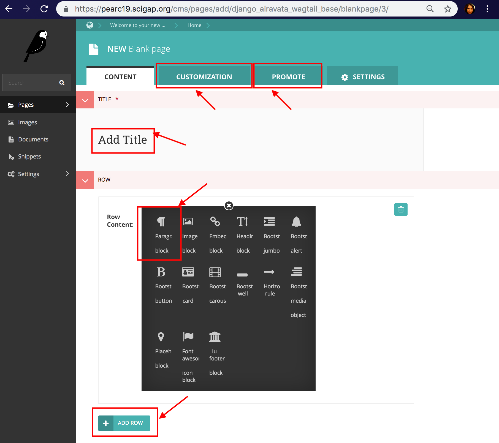

## Django Gateway Theme Management
In Django portal, the gateway branding or the theme is managed through a CMS. The Djangop portal uses WagTail CMS for the theme. 
The CMS takes care fo the gateway home page, child pages content.  
Gateways are initially deployed with a common base theme, but the gateway admins can re-brand according to their needs. 
In order to change the theme user needs to be in the Admin group. 

### Instructions on Gateway Theme
NOTE: For details instructions please refer <a href="https://github.com/apache/airavata-django-portal/blob/master/docs/cms.md" target="_blank"> Github CMS Instructions</a>

1. Login to your gateway portal.
   

2. Once logged in navigate to Home page.
  

3. Click on the Wagtail icon → Go to Wagtail Admin
  

4. You are no in Wagtail CMS
  

5. To create a new child page or to edit the existing Home page, navigate to Pages, on left.
  

6. Keep using the arrow and navigating until the page you want to edit appears in the list. To edit the Home page, use the right arrow and then click on Home or the pen icon.
  

7. Once the changes are done, Save as a draft or Publish or Preview from options at the bottom.
8. If you want to create a page as a child page of Home page, Click on the Pages link on the left side-bar.
9. You will get a side pop-up which will contain "Welcome to your new Wagtail Site" and a "pencil" icon and a "right-arrow" icon.
10. You will get "Home" Link. This is the default page. If you want to modify it you can click on "pencil" icon. if you already have any child pages to "Home", you will also be able to find a "right-arrow" icon
11. To create a new page as a child of "Home". you need to click on "Home" Link.
12. Then Click on "ADD CHILD PAGE" link.
13. Choose a page template type. Currently, three of them are available.
    - Blank Page -> (Build a page from scratch (Best Way))
    - Cybergateway Home Page -> (Build an IU Themed Home Page)
    - Home Page -> (Build a seagrid website based Home page)
14. Each page has four tabs namely:
    - CONTENT (On page load)
    - CUSTOMIZATION
    - PROMOTE
    - SETTINGS
15. Provide a title(required) for the page so that you can see it in the CMS.
16. Head over to the PROMOTE Section.
    - Provide a slug url ( which is the url extension at which the page will be available). for example if you are creating a documentation page. Provide a slug like documentation so that when you visit <--yourwebsite.com-->/documentation you will visit this page.
    - Provide a Page Title. This will show up in the page title of each page.
    

17. Once the changes are done, you can preview, publish or save as a draft.

 

